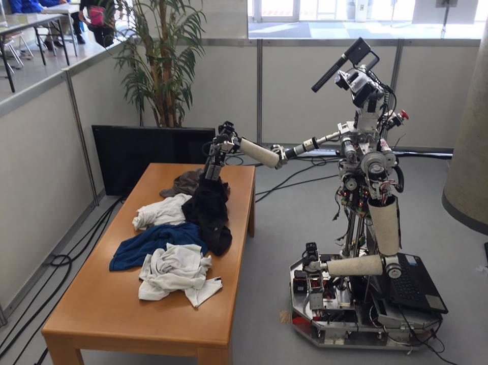
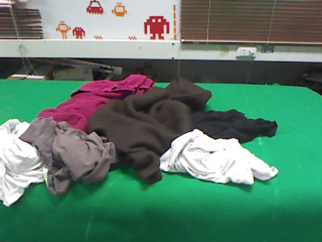
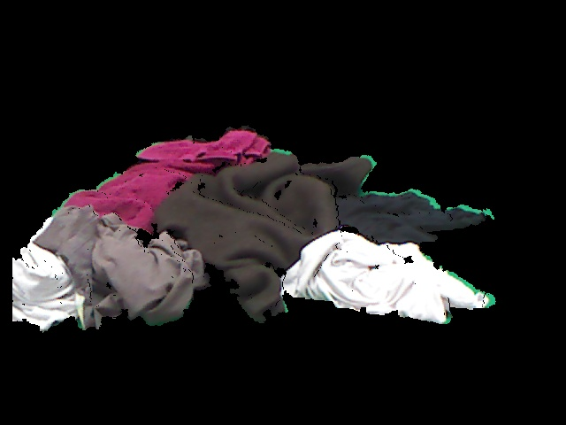

Clothes Dectection using PCL &amp; Efficient Graph Based Image Detection for a service robot on ROS
=============================================================================================================
This package was originally contributed to [skuba-athome organization](https://github.com/skuba-athome). 
I implement this ROS package based on PointCloud Library and Efficient Graph-Based Image Segmentation algorithm,   developed by Pedro F. Felzenszwalb and Daniel P. Huttenlocher, for clothes detection application.

  

References:
*  [OpenCV Wrapper for egbis](https://github.com/christofferholmstedt/opencv-wrapper-egbis)
*  [Implementation of original egbis algorithm](http://cs.brown.edu/%7Epff/segment/)

# Node's Procedure

# Preliminary Results

<table class="image" cellspacing="10">
<tr>
  <th>  1.ORIGINAL IMAGE </th>
  <th>  2.EUCLIDEAN CLUSTERING EXTRACTION</th>
  <th>  3.EGBIS SEGMENTATION  </th>
</tr>
<tr>
  <td> 
     
  </td> 
  <td> 
     
  </td> 
  <td> 
     
  </td> 
</tr>
</table>

